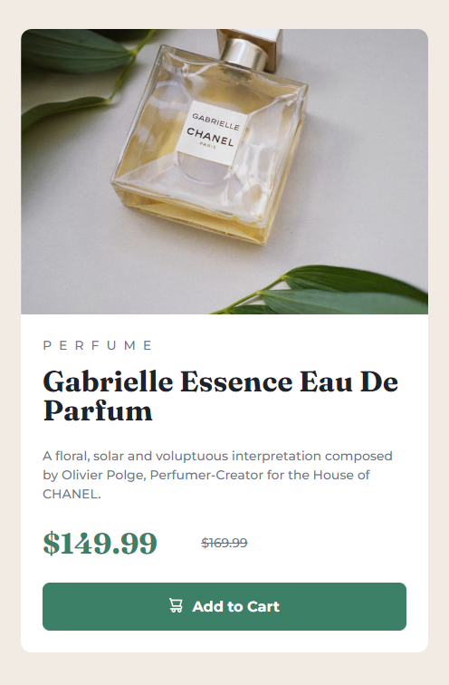
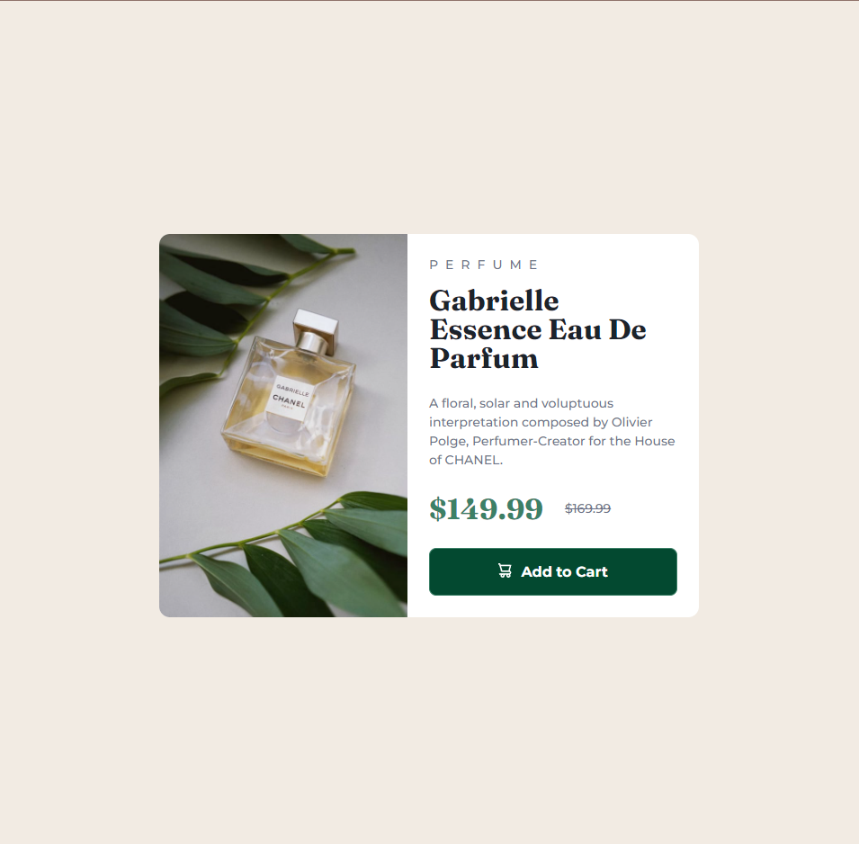

# Frontend Mentor - Product preview card component solution

This is a solution to the [Product preview card component challenge on Frontend Mentor](https://www.frontendmentor.io/challenges/product-preview-card-component-GO7UmttRfa). 

## Table of contents

- [Overview](#overview)
  - [The challenge](#the-challenge)
  - [Screenshot](#screenshot)
  - [Links](#links)
- [My process](#my-process)
  - [Built with](#built-with)
  - [What I learned](#what-i-learned)
  - [Useful resources](#useful-resources)
- [Author](#author)

## Overview

A product preview card resembling the one provided in the preview for the challenge from frontendmentor.io

### The challenge

Users should be able to:

- View the optimal layout depending on their device's screen size
- See hover and focus states for interactive elements

### Screenshot






### Links

- Live Site URL: (https://veena-k-venugopal.github.io/fm-product-preview-card/)

## My process

I focused on creating a semantic HTML for this challenge. I have added elements like section, main, header, picture etc. to make the markup more semantic. I styled the each section with appropriate paddings, margins, colors, font sizes, etc. I only moved on to the next section once I was happy with the current one. I also created custom properties for the styles that repeated.

### Built with

- Semantic HTML5 markup
- CSS custom properties
- Flexbox
- CSS Grid
- Mobile-first workflow

### What I learned

To set different images sources depending on the media sizes:

```html
<picture class="photo">
    <source media="(max-width: 786px)" srcset="images/image-product-mobile.jpg">
    <source media="(min-width: 787px)" srcset="images/image-product-desktop.jpg">
    
</picture>
```
To set equal width ratio for children of flex containers: 

```css
.main-card {
        display: flex;
        max-width: 600px;
    }

.photo,
.text-content {
        flex: 1;
    }
```

### Useful resources

- [Responsive images](https://codestitch.app/page-speed-handbook) - This helped me understand how to add multiple images optimized for respective screen sizes. This would help increase the overall responsiveness of the website.

## Author

- Frontend Mentor - [Veena-K-Venugopal](https://www.frontendmentor.io/profile/Veena-K-Venugopal)